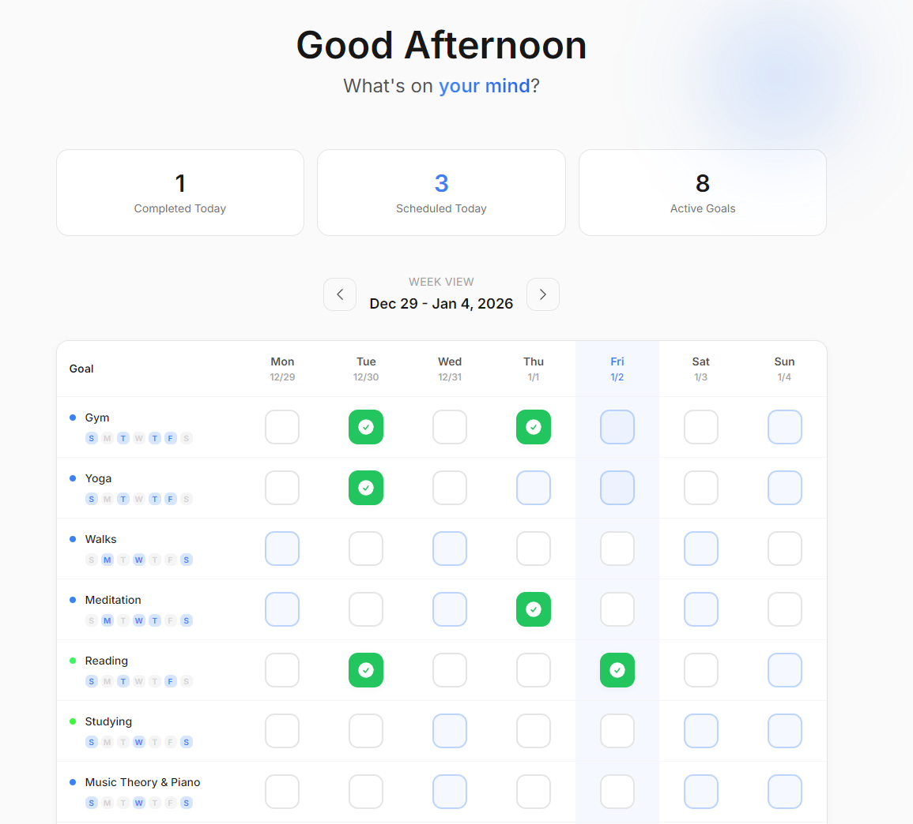

# 🎯 Goals - Personal Goal Tracker


  
A modern, minimalistic goal tracking application for managing weekly habits, annual goals, and long-term aspirations. Built with Next.js, TypeScript, and SQLite.

---

## ✨ Features

### 🏠 **Home Dashboard**
- **Daily Intentions** - Set and save your focus for the day (localStorage)
- **Today's Schedule** - View all weekly goals scheduled for today
- **Quick Completion** - Mark today's goals complete directly from home
- Clean, welcoming interface to start your day

### 📅 **Weekly Calendar** (Main Tracking Page)
- **Visual Grid Layout** - Goals in rows, days (Monday-Sunday) in columns
- **Three-State System** - Click cells to cycle through:
  - ⚪ **Empty** - Not planned or completed
  - 🔵 **Scheduled** - Planned day (subtle blue highlight)
  - ✅ **Completed** - Marked as done (green with checkmark)
- **Scheduled Days** - Subtle blue highlights show your fixed schedule
- **Week Navigation** - Browse through different weeks
- **Progress Tracker** - Beautiful progress bar at the bottom showing weekly completion percentage
- **Smart Highlighting** - Today's column subtly highlighted for context

### 🎯 **Goals Management Page**
- **Create & Edit Goals** - Beautiful form with proper validation
- **Reorder Goals** - Up/down arrows to organize your list
- **Day Selection** - Pick which days to schedule for each goal
- **Color Coding** - Choose colors for visual organization
- **Target Setting** - Define weekly frequency goals
- **Global Edit Mode** - Clean view with edit button to toggle editing UI
- **Persistent Storage** - All data saved to SQLite database

### 📆 **Year Goals Page**
- **Annual Planning** - Set and track goals for the current year
- **Flexible Progress Tracking**:
  - **Percentage Mode** - Manual progress updates (0-100%)
  - **Count Mode** - Automatic percentage calculation (e.g., "175 workouts this year")
    - Set target count
    - Increment/decrement with +/- buttons
    - Auto-calculated progress percentage
- **Expandable Descriptions** - Hide/show details to reduce clutter
- **Reorderable** - Organize by priority
- **Compact Cards** - Efficient use of space for quick scanning
- **Global Edit Mode** - Clean interface with dedicated edit view

### 🎯 **Decade Goals Page** (10-Year Goals)
- **Long-Term Vision** - Plan for the next 10 years
- **Progress Tracking** - Monitor multi-year objectives
- **Expandable Descriptions** - Toggle details as needed
- **Reorderable** - Prioritize what matters most
- **Clean Design** - Focused, distraction-free interface
- **Global Edit Mode** - Streamlined editing experience

### ✅ **To-Do List Page**
- **Task Management** - Simple, effective to-do tracking
- **Reorderable** - Organize tasks by priority
- **Quick Actions** - Add, complete, and delete tasks
- **Persistent Storage** - Tasks saved to database

### 🌅 **Daily Focus Page** (Today)
- **Animated Loading** - Goals appear one by one with smooth animations
- **Today's Goals** - All weekly goals scheduled for today
- **Tomorrow Preview** - See what's coming up next
- **Motivational View** - Start your day with clarity and focus

### 🎨 **Modern Design**
- **Minimalistic Interface** - Clean, distraction-free UI
- **Blue Accent Theme** - Professional blue gradients throughout
- **Responsive Layout** - Works on all screen sizes
- **Smooth Animations** - Polished interactions and transitions
- **Icon Sidebar** - Easy navigation between pages
- **Custom Favicon** - Branded checkmark icon with blue gradient

---

## 🚀 Quick Start

### Prerequisites
- Node.js 18+ 
- npm or yarn

### Development Setup

```bash
# Install dependencies
npm install

# Initialize database
npm run initialize

# Run database migrations (if needed)
npm run migrate:sortorder
npm run migrate:tracking

# Start development server
npm run dev
```

Open [http://localhost:3000](http://localhost:3000) in your browser.

### Docker Setup

```bash
# Start the application
docker-compose up -d

# Stop the application
docker-compose down
```

Open [http://localhost:3000](http://localhost:3000) in your browser.

---

## 📁 Project Structure

```
progress-tracker/
├── app/
│   ├── api/                      # API routes
│   │   ├── goals/                # Weekly goals CRUD
│   │   ├── year-goals/           # Year goals CRUD
│   │   ├── decade-goals/         # Decade goals CRUD
│   │   ├── todos/                # To-do list CRUD
│   │   ├── completions/          # Completion tracking
│   │   └── settings/             # User settings
│   ├── home/                     # Home dashboard page
│   ├── page.tsx                  # Weekly calendar (main page)
│   ├── goals/                    # Goals management page
│   ├── year-goals/               # Annual goals page
│   ├── decade-goals/             # 10-year goals page
│   ├── todos/                    # To-do list page
│   ├── today/                    # Daily focus page
│   ├── settings/                 # Settings page
│   ├── layout.tsx                # Root layout with sidebar
│   ├── globals.css               # Global styles
│   └── icon.svg                  # App favicon
│
├── components/
│   ├── Sidebar.tsx               # Left navigation sidebar
│   ├── DaySelector.tsx           # Day selection component
│   └── ui/                       # UI component library
│       ├── button.tsx
│       ├── input.tsx
│       ├── modal.tsx
│       ├── card.tsx
│       ├── checkbox.tsx
│       ├── progress.tsx
│       └── badge.tsx
│
├── lib/
│   ├── db.ts                     # SQLite database operations
│   ├── date-utils.ts             # Date manipulation helpers
│   └── utils.ts                  # Utility functions
│
├── types/
│   └── index.ts                  # TypeScript interfaces
│
├── data/
│   └── goals.db                  # SQLite database file
│
├── scripts/
│   ├── setup-database.js         # Database initialization
│   ├── migrate-add-sortorder-long-term.js
│   └── migrate-add-tracking-mode.js
│
└── public/
    ├── icon.svg                  # PWA icon
    └── manifest.json             # PWA manifest
```

---

## 💾 Database Schema

**SQLite Tables:**

- **`goals`** - Weekly habit goals
  - Name, color, emoji, description
  - Days of week (JSON array)
  - Target days per week
  - Sort order for custom ordering

- **`year_goals`** - Annual goals
  - Name, description, progress
  - Tracking mode (percentage/count)
  - Current count & target count (for count mode)
  - Sort order

- **`decade_goals`** - 10-year goals
  - Name, description, progress
  - Sort order

- **`todos`** - Task list items
  - Title, completed status, due date
  - Sort order

- **`completions`** - Goal completion records
  - Goal ID, completion date
  - Timestamps

- **`categories`** - Goal categories (future use)

- **`user_settings`** - User preferences

---

## 🎮 How to Use

### Getting Started
1. **Open the Home Page** - Set your daily intention
2. **View Today's Goals** - See what's scheduled for today
3. **Navigate to Calendar** - Click the calendar icon in the sidebar

### Weekly Goals Workflow
1. **Add Goals** - Go to Goals page, click "Add New Goal"
2. **Select Days** - Choose which days to schedule each goal
3. **Track on Calendar** - Click cells to mark complete (empty → scheduled → completed)
4. **Monitor Progress** - Check the progress bar at the bottom

### Annual & Long-Term Goals
1. **Year Goals** - Set annual objectives, choose percentage or count mode
2. **Decade Goals** - Define your 10-year vision
3. **Update Progress** - Edit cards to update progress
4. **Reorder** - Use up/down arrows to prioritize

### Daily Focus
1. **Visit Today Page** - See animated view of today's scheduled goals
2. **Preview Tomorrow** - Plan ahead with tomorrow's goals
3. **Stay Motivated** - Use as a daily check-in

---

## 🎯 Core Features Checklist

### ✅ Weekly Tracking
- [x] Weekly calendar grid (Monday-Sunday)
- [x] Three-state cells (empty/scheduled/completed)
- [x] Visual progress tracker
- [x] Week navigation
- [x] Scheduled day highlights
- [x] Goal reordering
- [x] Color-coded goals
- [x] Target days per week

### ✅ Long-Term Planning
- [x] Year goals with dual tracking modes
- [x] Count-based progress (auto-calculated %)
- [x] Decade goals
- [x] Expandable descriptions
- [x] Progress visualization
- [x] Custom ordering

### ✅ Daily Management
- [x] Home dashboard with intentions
- [x] Today's scheduled goals
- [x] Daily focus page with animations
- [x] To-do list
- [x] Quick completion from home

### ✅ User Experience
- [x] Modern, minimalistic design
- [x] Blue accent theme
- [x] Smooth animations
- [x] Responsive layout
- [x] Icon-based navigation
- [x] Global edit modes
- [x] Custom favicon & PWA support

### ✅ Data & Persistence
- [x] SQLite database
- [x] Database migrations
- [x] LocalStorage for daily intentions
- [x] RESTful API endpoints
- [x] Data integrity & validation

---

## 📊 API Endpoints

### Weekly Goals
- `GET /api/goals` - List all weekly goals
- `POST /api/goals` - Create new goal
- `GET /api/goals/[id]` - Get goal details
- `PUT /api/goals/[id]` - Update goal
- `DELETE /api/goals/[id]` - Delete goal
- `POST /api/goals/reorder` - Reorder goals

### Year Goals
- `GET /api/year-goals` - List all year goals
- `POST /api/year-goals` - Create year goal
- `GET /api/year-goals/[id]` - Get year goal
- `PUT /api/year-goals/[id]` - Update year goal
- `DELETE /api/year-goals/[id]` - Delete year goal
- `POST /api/year-goals/reorder` - Reorder year goals

### Decade Goals
- `GET /api/decade-goals` - List all decade goals
- `POST /api/decade-goals` - Create decade goal
- `GET /api/decade-goals/[id]` - Get decade goal
- `PUT /api/decade-goals/[id]` - Update decade goal
- `DELETE /api/decade-goals/[id]` - Delete decade goal
- `POST /api/decade-goals/reorder` - Reorder decade goals

### To-Dos
- `GET /api/todos` - List all todos
- `POST /api/todos` - Create todo
- `GET /api/todos/[id]` - Get todo
- `PUT /api/todos/[id]` - Update todo
- `DELETE /api/todos/[id]` - Delete todo
- `POST /api/todos/reorder` - Reorder todos

### Completions
- `GET /api/completions` - List completions (filter by date/goal)
- `POST /api/completions` - Mark goal complete
- `DELETE /api/completions/[id]` - Remove completion

### Other
- `GET /api/settings` - Get user settings
- `POST /api/settings` - Update settings
- `GET /api/analytics/streaks` - Get streak data

---

## 🔧 Tech Stack

**Frontend:**
- **Next.js 14** - React framework with App Router
- **TypeScript** - Type safety and better DX
- **Tailwind CSS** - Utility-first styling
- **React Hooks** - Modern state management
- **date-fns** - Date manipulation

**Backend:**
- **Next.js API Routes** - Serverless functions
- **better-sqlite3** - Fast, embedded database
- **Node.js** - Runtime environment

**DevOps:**
- **Docker** - Containerization
- **Docker Compose** - Multi-container orchestration

---

## 📝 Available Commands

```bash
# Development
npm run dev              # Start dev server (port 3000)
npm run build            # Build for production
npm run start            # Start production server
npm run lint             # Run ESLint

# Database
npm run initialize       # Set up fresh database
npm run migrate:sortorder # Add sortOrder columns
npm run migrate:tracking  # Add tracking mode fields

# Docker
docker-compose up -d     # Start containers
docker-compose down      # Stop containers
docker-compose logs -f   # View logs
```

---

## 🎨 Design Philosophy

**Simple & Focused**
- Clean, minimal interface with no distractions
- One feature per page with clear purpose
- Smooth, intuitive interactions
- Modern design language

**Efficient & Practical**
- Quick access to daily goals
- Visual weekly calendar for planning
- Flexible progress tracking (percentage or count-based)
- Global edit modes to reduce UI clutter

**Scalable & Maintainable**
- TypeScript for type safety
- Component-based architecture
- RESTful API design
- Database migrations for schema changes

---

## 🎯 Perfect For

- 📆 Building consistent weekly habits
- 🎯 Tracking annual objectives with measurable targets
- 🚀 Planning long-term life goals (10-year vision)
- ✅ Managing daily tasks and to-dos
- 📊 Visualizing progress across multiple timeframes
- 🧘 Starting each day with intention and clarity

---

## 🚀 Future Possibilities

- 📈 Advanced analytics and insights
- 🔥 Streak tracking and gamification
- 📱 Mobile app (PWA foundation already in place)
- 🔔 Reminders and notifications
- 📤 Data export (CSV, JSON)
- 🌙 Dark mode
- 👥 Multi-user support
- 🔄 Cloud sync
- 📊 Charts and visualizations
- 🏆 Achievement system

---

## � Security

- **Database**: SQLite database stored locally in the `data/` folder
- **JIRA Integration**: API tokens are stored in the local database (not version controlled)
- **No Cloud Storage**: All data remains on your local machine
- **Environment Variables**: Use `.env` for sensitive configuration (see `.env.example`)

**Important**: Never commit your `data/` folder or `.env` files to version control.

---

## �📄 License

MIT License - Feel free to use and modify for your personal projects.

---

## 🙏 Acknowledgments

Built with modern web technologies and a focus on simplicity, effectiveness, and user experience.

---

**Track your progress. Achieve your goals. One day at a time.** 🎯✨

*Version: 3.0.0 (Modern Blue Theme)*
